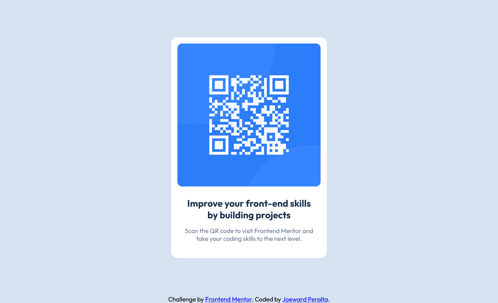

# Frontend Mentor - QR code component solution

This is a solution to the [QR code component challenge on Frontend Mentor](https://www.frontendmentor.io/challenges/qr-code-component-iux_sIO_H). Frontend Mentor challenges help you improve your coding skills by building realistic projects.

## Table of contents

- [Overview](#overview)
  - [Screenshot](#screenshot)
  - [Links](#links)
- [My process](#my-process)
  - [Built with](#built-with)
  - [What I learned](#what-i-learned)
- [Author](#author)

## Overview

### Screenshot

### Links

- Solution URL: [Add solution URL here](https://www.frontendmentor.io/solutions/responsive-qr-code-component-page-using-html-and-css-fh3SrDT5mU)
- Live Site URL: [Add live site URL here](https://joewardperalta.github.io/qr-code-component/)

## My process

### Built with

- Semantic HTML5 markup
- CSS custom properties
- Flexbox
- Mobile-first workflow

### What I learned

One key thing I learned was how to better plan, structure, and design a card component using semantic HTML and reusable CSS classes. I also developed a stronger understanding of how to position elements precisely as intended by leveraging Flexbox. This project taught me the importance of structured planning in producing clean, maintainable code and ensuring accessibility across different devices and screen sizes.

## Author

- Website - [Joeward Peralta](https://www.joewardperalta.dev)
- Frontend Mentor - [@joewardperalta](https://www.frontendmentor.io/profile/joewardperalta)
- LinkedIn - [@joewardperalta](https://www.linkedin.com/in/joewardperalta/)
